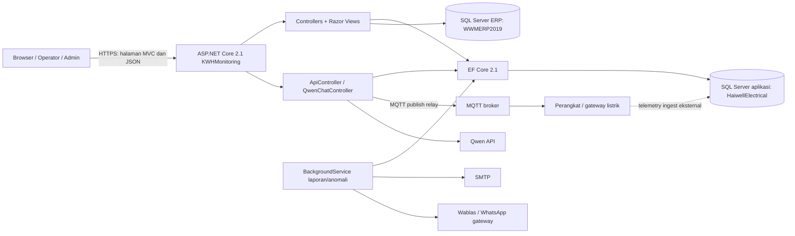
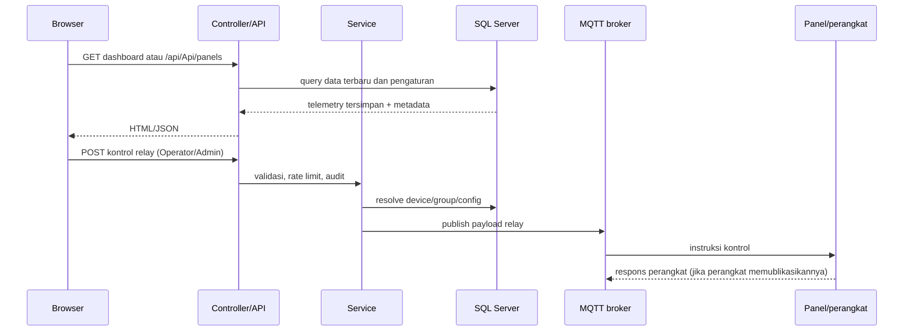
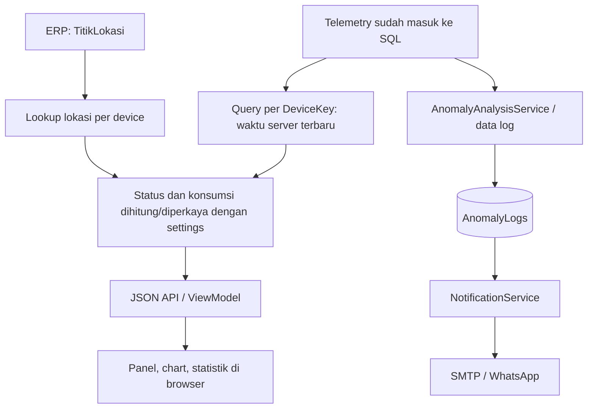
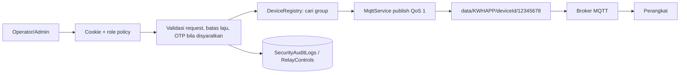
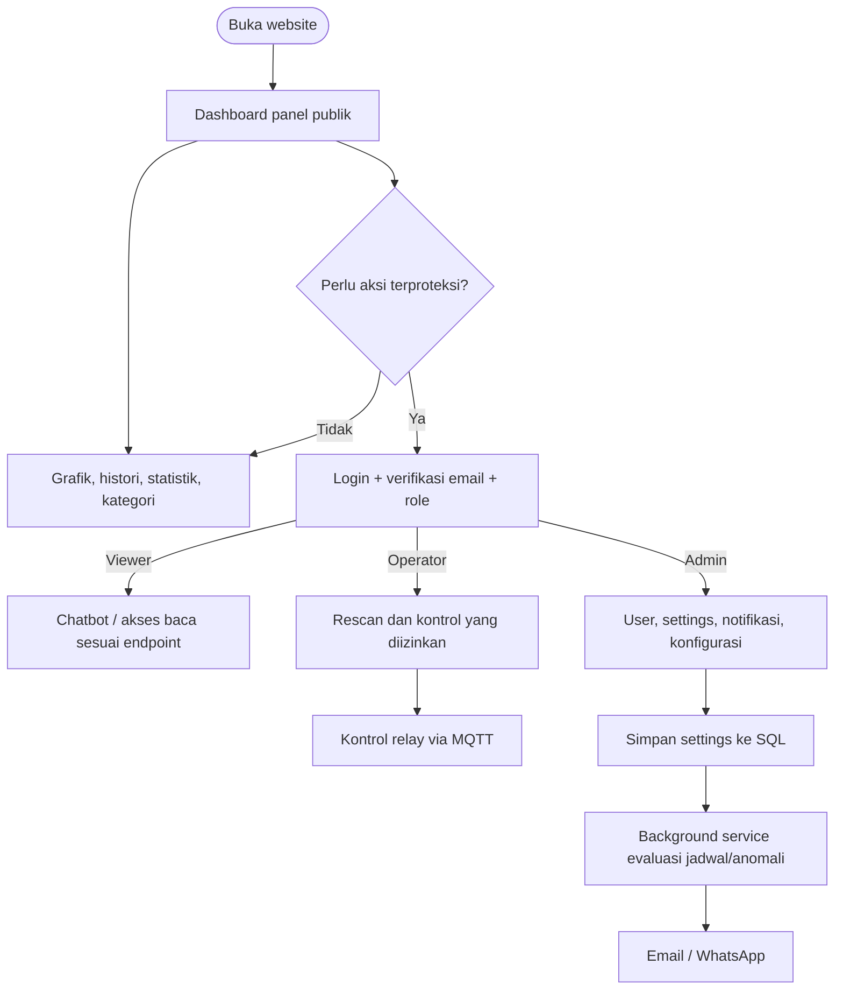

# Laporan Audit Teknis Website KWHMonitoring

**Tanggal pemeriksaan:** 30 September 2026  
**Cakupan utama:** `KWHMonitoring - .NET 2.1 - V7/KWHMonitoring` (kode aplikasi aktif yang dibuka pada IDE)  
**Metode:** inspeksi statis kode, konfigurasi, model, view, dan skrip database. Aplikasi tidak dijalankan; tidak ada perubahan pada kode proyek.

> Laporan ini menggambarkan implementasi yang ditemukan di source. Nilai konfigurasi runtime, keadaan database, ketersediaan broker dan layanan eksternal tidak diverifikasi.

## Ringkasan

KWHMonitoring adalah aplikasi web ASP.NET Core MVC 2.1 untuk pemantauan pemakaian listrik dan pengendalian relay perangkat. Aplikasi menyajikan halaman dashboard MVC/Razor dan API JSON di bawah `/api`. Backend memakai Entity Framework Core dengan SQL Server, berkomunikasi ke broker MQTT untuk instruksi relay, dan menyediakan notifikasi melalui SMTP serta gateway WhatsApp Wablas/Fonnte. Ada analisis anomali, ringkasan energi, pelaporan terjadwal, manajemen pengguna berbasis role, dan chatbot Qwen.

Secara umum alur pemantauan membaca rekaman terbaru per `DeviceKey` dari tabel `KWH_Monitoring`; rekaman tersebut berasal dari sistem/perangkat eksternal. Di source yang diaudit, `MqttService` tampak mengirim kontrol relay, bukan sebagai consumer telemetry. Karena itu jalur ingest telemetry tidak dapat dipastikan hanya dari kode web ini.

## Topologi

**Batas yang perlu diketahui:** koneksi SQL aplikasi dan ERP adalah dua sumber yang berbeda di konfigurasi. `TitikLokasiService` mengambil master lokasi dari ERP untuk melengkapi tampilan panel. Penyimpanan telemetry memakai database aplikasi. Arah panah perangkat menuju database merupakan interpretasi kebutuhan sistem; mekanisme ingest tidak tampak pada `MqttService` yang diperiksa dan perlu diverifikasi pada layanan/perangkat eksternal.

## Arsitektur dan cara kerja

1. `Program.cs` membangun host ASP.NET Core dan memuat `Startup`.
2. `Startup.ConfigureServices` mendaftarkan EF Core SQL Server, cache memory, layanan aplikasi, autentikasi cookie, policy role, HTTP client Qwen, dan background notification service (kecuali `KWH_DISABLE_NOTIFICATION_BG` mematikannya).
3. Saat startup, aplikasi menguji koneksi database dengan timeout singkat. Bila siap, migrasi dijalankan, admin dan konfigurasi perangkat di-seed, lalu cache pengaturan dihangatkan. Jika DB tidak tersedia, web tetap dapat start dan menampilkan penanganan error DB.
4. Middleware mengaktifkan HTTPS redirect, file statis, cookie policy, kompresi respons, autentikasi, security headers, dan routing MVC. Route default: `/{controller=Monitoring}/{action=Index}/{id?}`.
5. Browser meminta halaman melalui controller MVC atau data/aksi melalui API. Controller menggunakan `ApplicationDbContext` dan service; Razor menampilkan hasilnya. Dashboard memuat data secara bertahap melalui JavaScript/fetch.
6. Perintah relay diterbitkan ke MQTT setelah otorisasi dan validasi. Laporan/anomali dapat memicu email atau pesan WhatsApp.

## Fitur dan fungsi utama

| Area | Fungsi yang ditemukan |
|---|---|
| Dashboard monitoring | Daftar panel/perangkat, status, pencarian/filter fase, kartu panel, data realtime terakhir, grafik, detail, histori dan ekspor CSV. Halaman utama dan feed panel ditandai publik/read-only. |
| Energi dan statistik | API statistik pemakaian umum/perangkat serta tabel agregat harian, per jam, bulanan, tahunan. Terdapat peringkat penggunaan berdasarkan periode. |
| Pengaturan perangkat | Skala/mapping kolom, konfigurasi per-device, kategori perangkat, pengaturan status/downtime dan rescan panel. Konfigurasi efektif dibaca melalui `DeviceSettingsService`. |
| Kontrol relay | Publish ON/OFF/pulse ke broker MQTT; endpoint memeriksa akses Operator/Admin, ada batas laju lokal 10 request per 60 detik per pengguna dan pencatatan aksi. Detail validasi OTP/otorisasi per request harus dirujuk ke implementasi endpoint. |
| Anomali | Analisis dan log anomali, status/acknowledge/resolve/catatan, reset, dashboard tren/distribusi, snapshot grafik, laporan bulanan, pengaturan EMA dan downtime. |
| Notifikasi | Notifikasi instan dan laporan per jam/hari/bulan. Service latar belakang memeriksa jadwal setiap menit. Jadwal jam berjalan pada menit `:00`; tanggal kirim harian/bulanan disimpan dalam pengaturan. SMTP dan provider WhatsApp dikonfigurasi dari settings. |
| Akun dan keamanan | Registrasi, verifikasi email, login/logout cookie, reset kata sandi, approval admin, role Admin/Operator/Viewer, status aktif/lockout, audit keamanan. |
| Administrasi | Pengelolaan user/role/status (admin), pengaturan sistem, database, MQTT, sertifikat MQTT, notifikasi, chatbot, kategori dan transfer master admin. |
| Chatbot | Qwen chat untuk pengguna policy `RequireViewer`, log aktivitas dan data dashboard. Koneksi eksternal menggunakan named `HttpClient` `QwenClient`. |
| Lokasi panel | Tooltip/header panel dilengkapi data master lokasi yang dibaca dari database ERP melalui `TitikLokasiService`. |

## Sumber data dan model penyimpanan

### Sumber

- **Database aplikasi SQL Server (`DefaultConnection`):** telemetry, histori, pengguna, settings, log, kategori, energi agregat, konfigurasi perangkat, dan data anomali.
- **Database ERP (`WWMERPConnection` atau nama database/tabel konfigurasi):** master `TitikLokasi`, digunakan untuk nama/info lokasi perangkat. Service membatasi nama database/tabel melalui validasi identifier sebelum menyusun query.
- **Broker MQTT:** endpoint kontrol relay keluar. Broker, port, kredensial, TLS dan sertifikat dibaca dari konfigurasi aplikasi/settings database.
- **Provider eksternal:** SMTP, Wablas, gateway WhatsApp legacy, serta API Qwen. Data/API key disuplai konfigurasi atau settings.
- **Telemetry perangkat:** dashboard membaca tabel SQL yang sudah terisi. Source web yang ditinjau tidak membuktikan siapa/apa yang memasukkan data tersebut.

### Entitas penting (`ApplicationDbContext`)

| Tabel/DbSet (nama kode) | Peran |
|---|---|
| `KWH_Monitoring`, `KWHData_History` | Pengukuran terbaru dan histori perangkat. `DeviceKey`, `Waktu_Server` dipakai dalam query memilih rekaman terbaru. |
| `DailyEnergy`, `HourlyEnergy`, `MonthlyEnergy`, `YearlyEnergy` | Agregasi konsumsi energi. |
| `DeviceRegistry`, `DeviceSettings`, `ColumnMappings`, `ColumnScaleConfigs` | Identitas/grup perangkat dan aturan tampilan/penskalaan. |
| `AppSettingsRecords` | Key-value settings sistem, MQTT, notifikasi, kategori, status jadwal dan konfigurasi. |
| `AnomalyLogs`, `AnomalyChartSnapshots`, `AnomalyMonthlyReports` | Temuan, snapshot visual, laporan anomali. |
| `ApplicationUsers`, `EmailVerificationTokens` | Identitas login, role/status dan token verifikasi/reset/approval. |
| `SecurityAuditLogs`, `AppLogs`, `FailedMessages`, `RelayControls` | Audit keamanan, diagnostik, kegagalan pesan, dan aksi kontrol. |

Skema lengkap dan constraint ada di `scripts/database_schema.sql`; konfigurasi EF dan indeks ada di `Models/ApplicationDbContext.cs`. Migrasi juga digunakan saat startup. Jangan menganggap skrip SQL dan migrasi selalu identik tanpa membandingkannya pada database target.

### Alur data

## API dan endpoint

### Pola route

- `ApiController` memakai `[Route("api/[controller]")]`, sehingga prefiks aktual adalah **`/api/Api`** (perhatikan nama controller), dengan subroute yang dideklarasikan per action.
- `QwenChatController` memakai prefiks **`/api/qwenchat`**.
- Controller MVC menggunakan pola `/Monitoring/{Action}` dan `/Account/{Action}`; route default juga menyediakan URL berbasis controller/action.
- `HealthController` menyediakan pemeriksaan database; lihat action `Db` untuk detail respons.

### Endpoint API utama

Daftar di bawah dikelompokkan menurut operasi. Seluruh pola subroute merujuk ke `/api/Api`; parameter path/query mengikuti signature action. Hak akses yang dicantumkan eksplisit pada source; action tanpa atribut role tidak otomatis berarti akses publik karena akses akhirnya juga bergantung pada middleware/atribut di controller atau konfigurasi.

| Method | Subroute | Fungsi | Akses eksplisit |
|---|---|---|---|
| GET | `/panels` | Daftar panel terbaru, filter pencarian/status/fase | Publik (`AllowAnonymous`) |
| GET | `/panels/{deviceKey}/chart` | Titik data grafik perangkat | sesuai atribut/action |
| GET | `/statistics`; POST `/usage-statistics`, `/usage-statistics/{deviceKey}` | Statistik energi umum dan per perangkat | sesuai atribut/action |
| GET | `/realtime-kwh`, `/energy-tables`, `/get-tariff`; POST `/save-tariff` | Nilai KWh, tabel agregat, tarif | sesuai atribut/action |
| GET | `/history`, `/history-grid`, `/history-archive`; GET `/history-export`, `/history-archive-export` | Histori, arsip, ekspor | sesuai atribut/action |
| POST | `/save-system-settings` | Simpan konfigurasi sistem | admin |
| GET | `/get-system-settings`, `/get-ema-settings`; POST `/test-database-connection`, `/test-mqtt-connection`, `/save-ema-settings` | Baca setting dan uji koneksi/config | sesuai atribut/action; operasi sensitif dibatasi |
| POST | `/upload-mqtt-certificate`, `/remove-mqtt-certificate` | Upload/hapus sertifikat MQTT | admin |
| POST | `/publish-relay`, `/request-relay-otp` | Kontrol relay dan permintaan OTP | Operator/Admin pada kontrol |
| GET/POST | `/relay-states`, `/device-control-mode` | Status relay/mode kontrol | sesuai atribut/action |
| GET/POST | `/get-downtime-settings`, `/save-downtime-settings`, `/downtime-status`, `/downtime-settings/{category}`, `/all-downtime-settings` | Konfigurasi dan status downtime | admin pada penyimpanan |
| GET | `/anomaly-logs/summary`, `/anomaly-logs/{deviceKey}`, `/anomaly-status`, `/get-initial-ema/{deviceKey}` | Daftar/status/parameter anomali | sesuai atribut/action |
| POST | `/log-anomaly`, `/reset-anomaly-alert` | Catat/reset notifikasi anomali | sesuai atribut/action |
| GET | `/anomaly-logs/detail/{id}` | Detail log | sesuai atribut/action |
| POST/PUT | `/anomaly-logs/{id}/acknowledge`, `/resolve`, `/notes` | Proses log anomali | sesuai atribut/action |
| DELETE | `/anomaly-logs/{id}`, `/anomaly-logs/clear-all`, `/anomaly-logs/clear/{deviceKey}`, `/reset-chart-data/{deviceKey}` | Hapus/reset data anomali/grafik | admin pada operasi sensitif |
| GET | `/anomaly-dashboard`, `/anomaly-trends`, `/anomaly-device-distribution` | Agregat dashboard anomali | sesuai atribut/action |
| POST `/anomaly-monthly-report/generate`; GET `/anomaly-monthly-report` | Generate dan ambil laporan bulan | sesuai atribut/action |
| GET | `/anomaly-operator-actions`, `/anomaly-operator-actions/summary` | Audit aksi operator | sesuai atribut/action |
| POST/GET | `/anomaly-logs/{id}/chart-snapshot` | Update/ambil snapshot grafik | sesuai atribut/action |
| GET/POST | `/device-category/{deviceKey}`, `/device-category`, `/categories`, `/categories/{name}`, `/device-categories` | Mapping, daftar, tambah/ubah/hapus kategori | sesuai atribut/action |
| GET | `/get-notification-settings`, `/get-notification-settings-full` | Baca pengaturan notifikasi | admin untuk data sensitif |
| POST | `/save-notification-settings`, `/save-anomaly-settings`, `/save-anomaly-state` | Simpan notifikasi dan status analisis | admin |
| POST | `/transfer-master-admin` | Transfer admin utama | admin |
| POST | `/test-email-notification`, `/test-whatsapp-notification`, `/test-instant-alert`, `/test-hourly-report`, `/test-daily-report`, `/test-monthly-report` | Uji notifikasi/laporan | Admin |
| GET/POST | `/wablas/settings`, `/wablas/test`, `/wablas/device-status` | Pengaturan/uji/status Wablas | Admin untuk pengaturan/uji |
| GET/POST | `/chatbot-settings`, `/test-chatbot-connection` | Konfigurasi/uji chatbot | Admin |
| GET | `/device-settings`, `/device-settings/{deviceKey}` | Baca konfigurasi efektif perangkat | daftar efektif publik; detail lihat atribut |
| POST | `/device-settings/{deviceKey}`, `/device-settings/bulk` | Simpan konfigurasi perangkat tunggal/banyak | Admin |
| POST | `/rescan-panels` | Pindai ulang panel | Operator/Admin |

**Catatan kelengkapan:** controller berisi banyak action dan variasi route; tabel ini adalah indeks fungsi route tingkat tinggi berdasarkan source, bukan spesifikasi kontrak OpenAPI. Untuk nama parameter/format request, validasi, status code dan otorisasi tepat per endpoint, rujuk atribut dan body action di `Controllers/ApiController.cs`. Route khusus Qwen tercantum berikut.

### Qwen Chat

Seluruh endpoint memerlukan policy `RequireViewer` (Viewer, Operator, Admin):

| Method | Route | Fungsi |
|---|---|---|
| POST | `/api/qwenchat/send` | Kirim pertanyaan/data konteks ke Qwen |
| GET | `/api/qwenchat/activity-log` | Ambil log aktivitas chatbot |
| GET | `/api/qwenchat/current-dashboard-data` | Data dashboard untuk konteks chatbot |
| GET | `/api/qwenchat/test` | Uji koneksi Qwen |

### MVC dan akun

Action penting yang ditemukan: `/Monitoring` (dashboard publik), `/Monitoring/Charts`, `/Monitoring/AnomalyLogs`, `/Monitoring/UsageStatistics`, `/Monitoring/UsageRanking`, `/Monitoring/UsageStatisticsDocs`, `/Monitoring/Settings` (Admin), `/Monitoring/Details/{deviceKey}`, `/Monitoring/History/{deviceKey}`, `/Monitoring/ExportCSV/{deviceKey}`, `/Monitoring/UpdateSettings` (Admin), `/Monitoring/GetSettings` (Admin), `/Monitoring/RescanPanels` (Operator/Admin).

Alur akun ada di `/Account/Login`, `/Register`, `/RegistrationSuccess`, `/VerifyEmail`, `/ResendVerification`, `/ForgotPassword`, `/ForgotPasswordConfirmation`, `/ResetPassword`, `/ResetPasswordSuccess`, `/Logout` (POST), dan `/AccessDenied`. Approval akses admin memakai `/AdminApproval/Approve` (GET konfirmasi dan POST keputusan) serta `/AdminApproval/Reject`. Manajemen user admin memakai `/UserManagement` beserta action ubah role, aktif/nonaktif, dan hapus. `/Health/Db` merupakan endpoint diagnostik database.

## Integrasi MQTT dan kontrol relay

`MqttService` merupakan singleton dan mengelola koneksi broker, TLS opsional, kredensial dan sertifikat. Untuk perintah, service mencari `GroupName` pada `DeviceRegistry` (fallback `RELAY_CONTROL`), kemudian mengirim JSON ke topic berbentuk `data/KWHAPP/{deviceId}/12345678` dengan QoS AtLeastOnce dan retain false. Payload memuat waktu terminal, group dan nilai `RC`. Pulse mengirim nilai aktif lalu nilai `0` setelah durasi yang ditentukan.

Publikasi bukan bukti bahwa relay berhasil berubah secara fisik; hal itu bergantung pada konektivitas, protokol perangkat dan telemetry/ack yang tidak dapat dibuktikan oleh pemanggilan publish saja.

## Keamanan dan kontrol akses

- Login memakai cookie `HttpOnly`, `SameSite=Lax`, masa berlaku 30 menit dengan sliding expiration. `SecurePolicy` adalah `SameAsRequest`; TLS di edge/deployment perlu dipastikan agar cookie produksi selalu secure.
- Policy `RequireAdmin`, `RequireOperator` (Operator/Admin), `RequireViewer` (Viewer/Operator/Admin) didefinisikan. Sejumlah feed dashboard secara sengaja publik; endpoint mutasi sensitif memiliki role attribute.
- Token email disimpan pada entitas token dengan hash/purpose/expiry menurut model dan indeks EF. Password melalui `PasswordHasher`; pengaturan sensitif tertentu memakai `AesEncryptionService`.
- Security headers disetel di middleware; CSP masih mengizinkan inline script dan `unsafe-eval`, sesuai kebutuhan frontend saat ini namun mengurangi ketatnya mitigasi XSS.
- Rate limit relay berbasis `IMemoryCache` lokal per instance, sehingga tidak terdistribusi lintas server/restart.
- Filter `DatabaseExceptionFilter` menangani error DB agar pengguna mendapat halaman diagnostik yang sesuai.

## Temuan audit dan risiko penting

### Tinggi: kredensial database tampak tersimpan langsung dalam konfigurasi

`appsettings.json` V7 berisi connection string SQL dengan username/password dalam teks biasa, termasuk akun database ERP. Nilai sengaja tidak disalin ke laporan. File konfigurasi masuk dalam source tree; perlakukan kredensial tersebut sebagai terekspos: rotasi password/credential pada kedua database dan pindahkan rahasia ke environment/secret store di luar repo. Periksa juga salinan/build/publish historis. Hindari menaruh rahasia baru dalam dokumen ini.

### Sedang: runtime .NET Core 2.1 sudah tua

Project menargetkan `netcoreapp2.1` dan paket EF Core 2.1.14. Ini generasi runtime lama; perencanaan upgrade framework dan dependensi diperlukan untuk memperoleh dukungan keamanan modern. Versi dukungan saat ini tidak diverifikasi eksternal dalam audit ini.

### Sedang: jalur masuk telemetry tidak tampak pada service MQTT web

Web membaca data telemetry dari SQL dan `MqttService` yang ditinjau menerbitkan kontrol relay. Pemilik proses ingest, validasi payload, retry dan rekonsiliasi data perlu didokumentasikan pada komponen eksternal yang mengisi SQL.

### Sedang: kontrak dan otorisasi API sulit ditinjau dari dokumentasi

Tidak ditemukan spesifikasi OpenAPI yang menjadi sumber kontrak. API sangat luas dalam satu `ApiController`; role atribut bervariasi. Dokumentasi endpoint/otorisasi perlu dipelihara bersama source, dan evaluasi kebijakan harus memeriksa setiap action terutama operasi ubah/hapus, pengaturan provider, upload sertifikat, serta feed anonim.

### Operasional

- Saat DB mati, aplikasi dapat tetap listen tetapi fitur yang perlu DB tetap gagal; pantau critical log dan `/Health/Db`.
- Pengiriman jadwal memakai timer dan jam lokal proses (`DateTime.Now`), bukan scheduler terdistribusi. Lebih dari satu instance dapat mengirim laporan ganda karena guard pengiriman berada di memori, meskipun tanggal harian/bulanan disimpan ke DB.
- Kredensial, certificate file dan kunci enkripsi harus dilindungi dan dikelola konsisten dengan backup serta pemulihan.
- Folder output `bin`, `obj`, `.vs` dan dokumen historis ada di workspace; bedakan artefak build dari source saat distribusi dan tinjau agar salinan konfigurasi rahasia tidak ikut dipaketkan.

## Visualisasi action pengguna

## Struktur kode untuk orientasi

| Lokasi | Isi |
|---|---|
| `Program.cs`, `Startup.cs` | Bootstrap, DI, middleware, route, migrasi dan seeding |
| `Controllers/MonitoringController.cs` | Halaman dashboard, grafik, histori, pengaturan |
| `Controllers/ApiController.cs` | API monitoring, setting, relay, anomali, notifikasi dan laporan |
| `Controllers/AccountController.cs`, `AdminApprovalController.cs`, `UserManagementController.cs` | Autentikasi dan administrasi user |
| `Controllers/QwenChatController.cs` | Integrasi chatbot Qwen |
| `Models/ApplicationDbContext.cs` dan `Models/*.cs` | Skema ORM dan domain |
| `Services/MqttService.cs` | Koneksi/publish MQTT dan TLS |
| `Services/AnomalyAnalysisService.cs`, `AnomalyNotificationBackgroundService.cs`, `NotificationService.cs` | Analisis dan notifikasi terjadwal |
| `Services/TitikLokasiService.cs` | Lookup master lokasi ERP |
| `Services/DeviceSettingsService.cs`, `AppSettingsCache.cs` | Pengaturan efektif dan cache |
| `Views/`, `wwwroot/` | Razor UI, JavaScript, CSS, chart/vendor assets |
| `scripts/database_schema.sql`, migrasi | Skema dan inisialisasi database |

## Batas audit

Audit ini statis. Tidak ada pengujian endpoint, verifikasi hak akses lewat HTTP, validasi database aktual, penangkapan trafik MQTT, pemeriksaan konfigurasi server produksi, atau pengujian kerentanan dinamis. Sebagian perilaku yang bergantung deployment/provider ditandai sebagai belum terverifikasi. File laporan ini adalah satu-satunya file baru yang dimaksudkan oleh tugas ini.
