# Flowchart Sistem KWH Monitoring

## 1. Arsitektur Sistem Keseluruhan

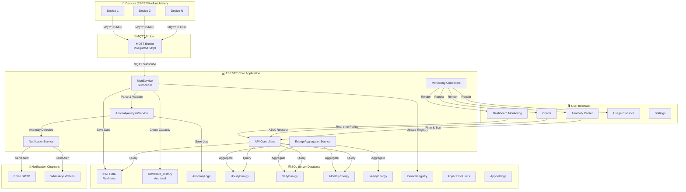

---

## 2. Flow Data MQTT ke Database

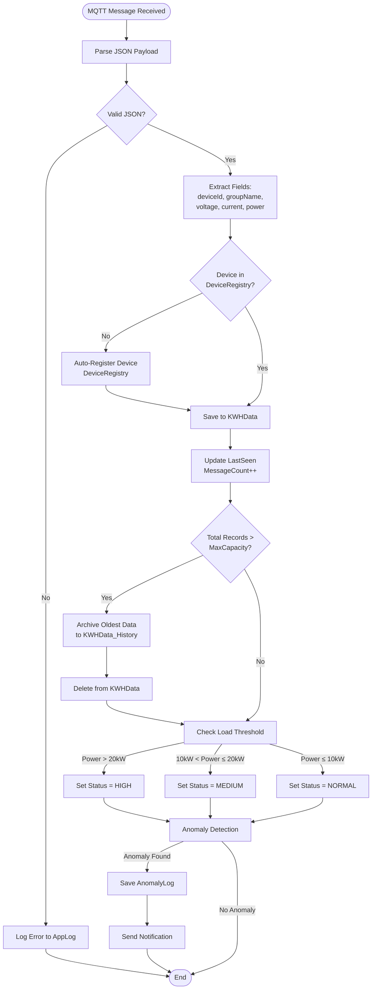

---

## 3. Flow Anomaly Detection

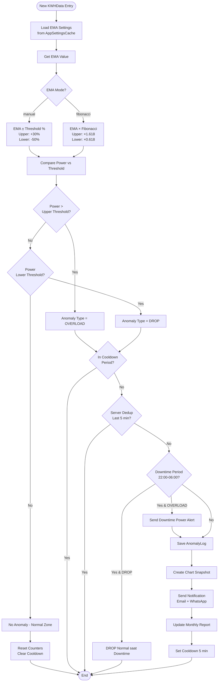

---

## 4. Flow Authentication & Authorization

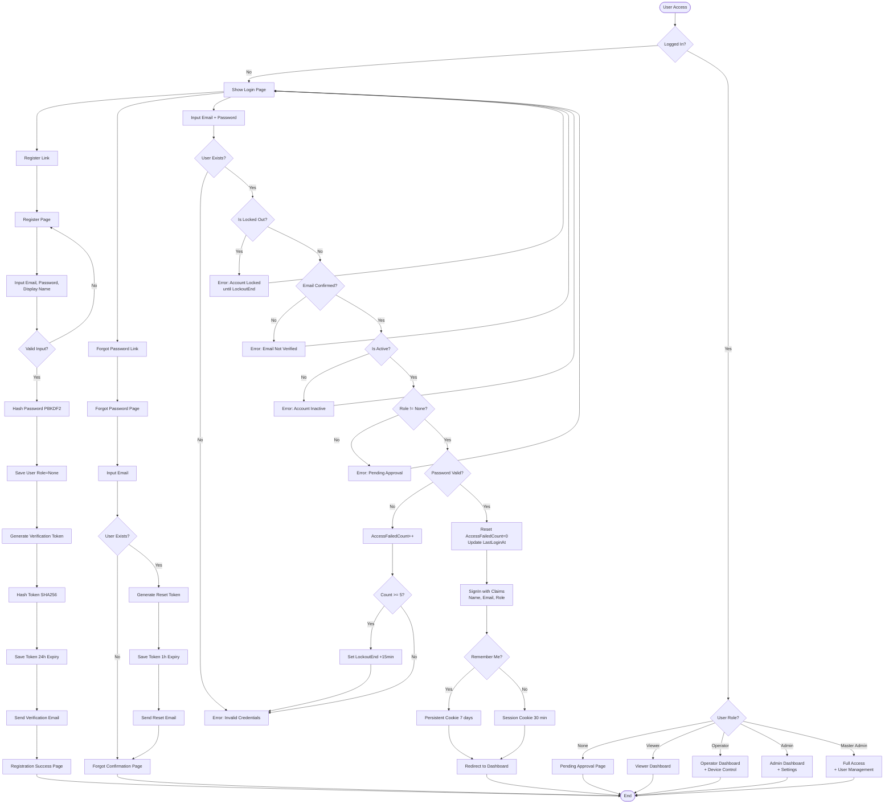

---

## 5. Flow Energy Aggregation

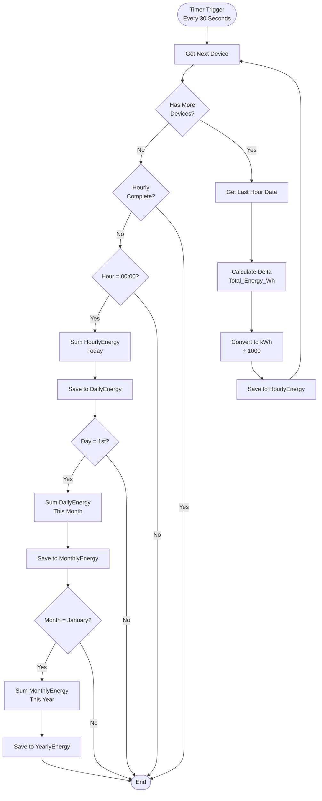

---

## 6. Flow Notification System

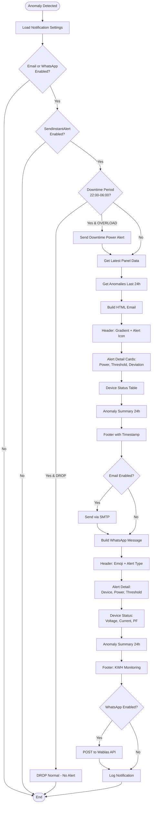

---

## 7. Flow Relay Control dengan OTP

```mermaid
flowchart TD
    Start([User Click ON/OFF]) --> CheckAuth{Authenticated?}
    
    CheckAuth -->|No| LoginRedirect[Redirect to Login]
    LoginRedirect --> End([End])
    
    CheckAuth -->|Yes| IsOff{OFF Button?}
    
    IsOff -->|Yes| ShowOTP[Show OTP Modal]
    ShowOTP --> InputOTP[User Input 6-digit OTP]
    InputOTP --> ValidateOTP{OTP Valid?}
    
    ValidateOTP -->|No| OTPError[Show Error Message]
    OTPError --> ShowOTP
    
    ValidateOTP -->|Yes| RateLimitCheck
    IsOff -->|Yes| RateLimitCheck{Rate Limited?<br/>10 req/60s}
    
    RateLimitCheck -->|Yes| RateError[Return Error 429]
    RateError --> End
    
    RateLimitCheck -->|No| LogSecurity[Log Security Action<br/>RelayControl]
    LogSecurity --> BuildTopic[Build MQTT Topic:<br/>data/KWHAPP/{deviceId}/12345678]
    BuildTopic --> BuildPayload[Build JSON Payload:<br/>{_terminalTime, _groupName, RC}]
    BuildPayload --> CheckConnection{MQTT Connected?}
    
    CheckConnection -->|No| ConnectMQTT[Connect to Broker]
    ConnectMQTT --> Publish
    CheckConnection -->|Yes| Publish[Publish via MQTTnet<br/>QoS 1]
    
    Publish --> Success{Publish Success?}
    Success -->|Yes| LogSuccess[Log Success to RelayControls]
    Success -->|No| LogFail[Log Failure to AppLog]
    
    LogSuccess --> UpdateUI[Update UI Status]
    LogFail --> UpdateUI
    
    UpdateUI --> End
```

---

## 8. Flow User Management (Master Admin)

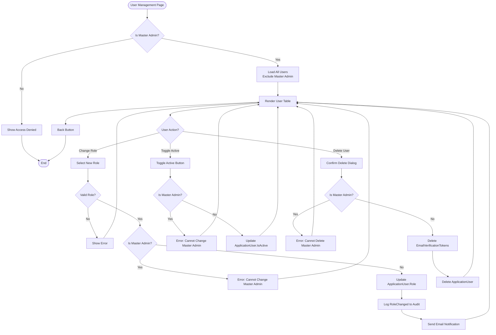

---

## 9. Background Service Loop

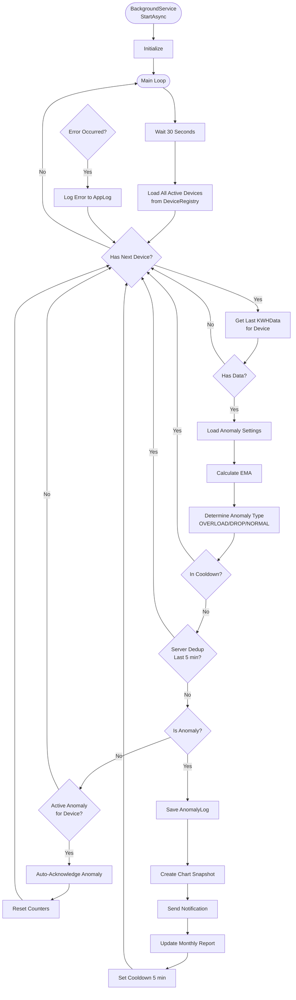

---

## 10. Sequence Diagram - End-to-End Flow

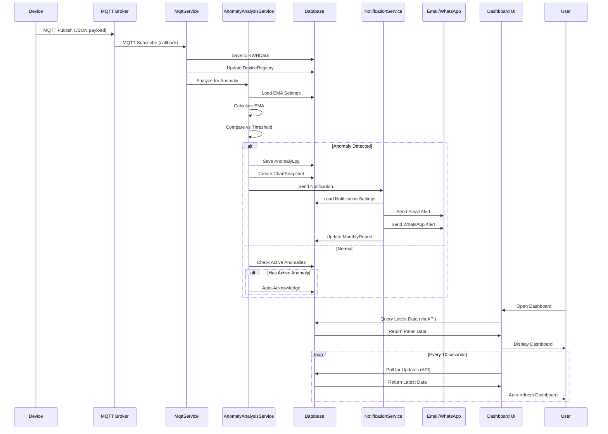

---

## 11. Database Entity Relationship

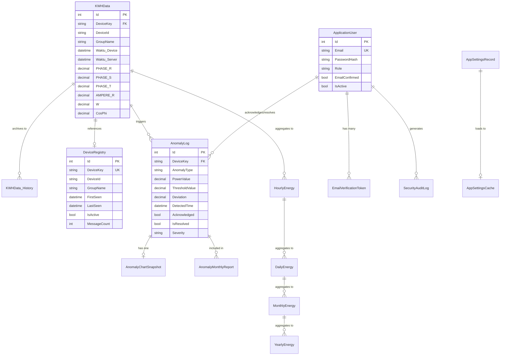

---

## 12. Deployment Architecture

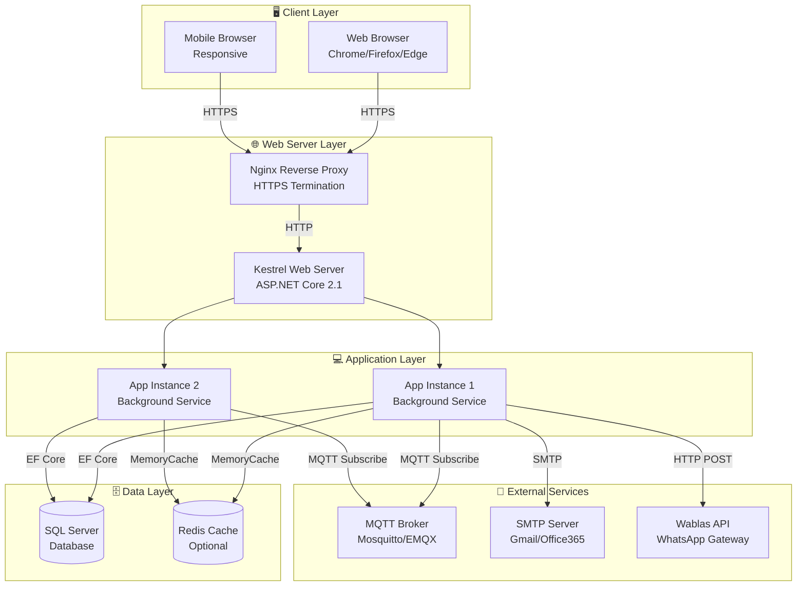

---

## 13. Flow Export CSV

```mermaid
flowchart TD
    Start([User Click Export CSV]) --> CheckAuth{Authenticated?}
    
    CheckAuth -->|No| LoginRedirect[Redirect to Login]
    LoginRedirect --> End([End])
    
    CheckAuth -->|Yes| GetDeviceKey{DeviceKey<br/>Provided?}
    
    GetDeviceKey -->|No| GetAll[Get All Devices Data]
    GetDeviceKey -->|Yes| GetSingle[Get Single Device Data]
    
    GetAll --> QueryDB[Query KWHData<br/>ORDER BY Waktu_Server DESC<br/>TOP 50000]
    GetSingle --> QueryDB
    
    QueryDB --> BuildCSV[Build CSV String]
    BuildCSV --> Header[Add Header Row:<br/>Id,DeviceKey,DeviceId,...]
    Header --> LoopData[Loop Through Records]
    
    LoopData --> EscapeFields[CsvEscape Fields:<br/>DeviceKey, DeviceId, GroupName]
    EscapeFields --> FormatDateTime[Format DateTime:<br/>yyyy-MM-dd HH:mm:ss]
    FormatDateTime --> FormatNumbers[Format Numbers:<br/>CultureInfo.InvariantCulture]
    FormatNumbers --> AppendRow[Append CSV Row]
    AppendRow --> MoreRecords{More Records?}
    
    MoreRecords -->|Yes| LoopData
    MoreRecords -->|No| ConvertBytes[Convert to UTF-8 Bytes]
    ConvertBytes --> GenFilename[Generate Filename:<br/>KWH_Monitoring_{timestamp}.csv]
    GenFilename --> ReturnFile[Return FileResult<br/>text/csv]
    ReturnFile --> End
```

---

## 14. Flow Settings Management

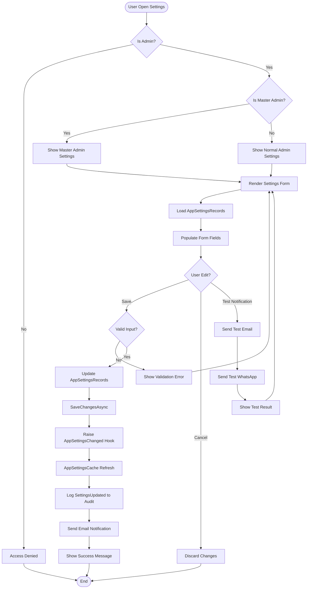

---

Dokumentasi flowchart ini dibuat pada: **18 September 2026**  
Format: **Mermaid.js** (compatible dengan GitHub, GitLab, Notion, Obsidian)  
Total Diagram: **14 flowchart berbeda**  
Coverage: **End-to-end system flow**
